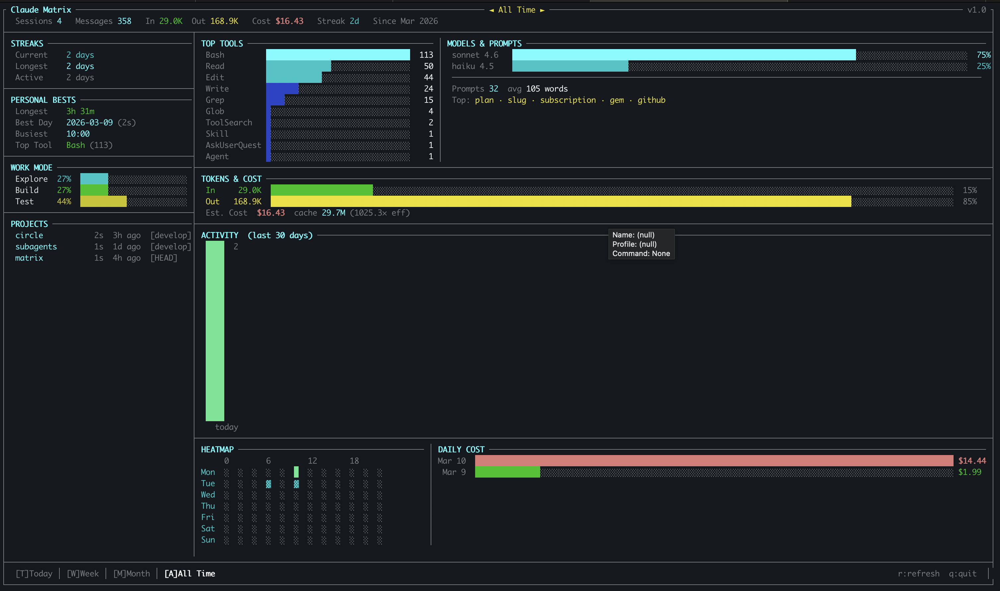

# Claude Matrix

A privacy-first, terminal analytics dashboard for [Claude Code](https://claude.ai/code). It reads your local Claude Code session data (reads ~/.claude/ directly, never touches the network) — sessions, tools, tokens, cost, streaks — and renders a live TUI right in your terminal. No cloud, no API calls, no configuration. Just run it and see your usage, coding patterns.




---

## Features

- **Full-screen TUI** — btop-inspired two-column layout that fills your terminal exactly, no scrolling
- **Streaks** — current and longest coding streaks, active days
- **Personal bests** — longest session, most productive day, busiest hour, favorite tool
- **Work mode** — Explore / Build / Test breakdown based on tool usage patterns
- **Top tools** — ranked bar chart with gradient coloring
- **Tokens & cost** — input/output token bars with estimated cost (color-coded green → yellow → red)
- **Activity chart** — last 30-day bar chart
- **Heatmap** — sessions by day-of-week × hour (on taller terminals)
- **Time filters** — Today / Week / Month / All Time, switch with a single key
- **100% local** — reads `~/.claude/` directly, never touches the network
- **Git branch tracking** — shows the branch you were on per project

---

## Requirements

- Ruby 3.0+
- macOS or Linux
- Claude Code installed and used at least once
- A terminal with Unicode and color support (iTerm2, Warp, Kitty, Alacritty, etc.)

---

## Installation

```bash
gem install claude-matrix
```

**From source:**

```bash
git clone https://github.com/kapilbhosale/Claude-Code-Matrix
cd claude-matrix
bundle install
bundle exec bin/claude-matrix
```

---

## Usage

### Launch the dashboard

```bash
claude-matrix
# or
claude-matrix dashboard
```

### Dashboard keyboard controls

| Key | Action |
|-----|--------|
| `t` | Filter: Today |
| `w` | Filter: This Week |
| `m` | Filter: This Month |
| `a` | Filter: All Time |
| `r` | Refresh data |
| `q` | Quit |

### Quick stats (no TUI)

### Check data sources

```bash
claude-matrix doctor
```

---

## How it works

Claude Code writes session transcripts to `~/.claude/projects/`. Claude Matrix reads those JSONL files directly on each refresh — no background daemon, no database, no setup.

```
~/.claude/
├── stats-cache.json          # pre-computed stats (optional bonus)
├── history.jsonl             # all prompts ever typed
└── projects/
    └── {encoded-path}/
        └── {session-uuid}.jsonl   ← parsed on every run
```

Each session file is parsed for:
- Tool calls (`Bash`, `Read`, `Write`, `Edit`, …)
- Token usage and model name (for cost estimation)
- Timestamps (for streaks and heatmap)
- Git branch (shown in Projects panel)

---

## Cost estimation

Estimated costs use published Claude API pricing (per 1M tokens):

| Model | Input | Output | Cache read | Cache write |
|-------|------:|-------:|-----------:|------------:|
| claude-opus-4.x | $15 | $75 | $1.50 | $18.75 |
| claude-sonnet-4.x | $3 | $15 | $0.30 | $3.75 |
| claude-haiku-4.x | $0.80 | $4 | $0.08 | $1.00 |

> These are estimates. Actual billed amounts may differ.

---

## Project structure

```
claude-matrix/
├── bin/
│   └── claude-matrix              # executable
├── lib/
│   ├── claude_matrix.rb           # entry point
│   └── claude_matrix/
│       ├── cli.rb                 # command router + interactive loop
│       ├── readers/
│       │   ├── session_parser.rb  # JSONL parser
│       │   ├── stats_reader.rb    # stats-cache.json reader
│       │   └── history_reader.rb  # history.jsonl reader
│       ├── analyzers/
│       │   └── metrics.rb         # streaks, work modes, cost, heatmap grid
│       └── visualizers/
│           └── dashboard.rb       # full-screen TUI renderer
├── Gemfile
├── claude-matrix.gemspec
└── README.md
```

---


## Releasing a new version

1. Bump `VERSION` in `lib/claude_matrix/version.rb`
2. Add an entry to `CHANGELOG.md`
3. Commit, tag, and push:

```bash
git add -A
git commit -m "Release v1.x.x"
git tag v1.x.x
git push && git push --tags
```

---

## Contributing

1. Fork the repo
2. Create a branch: `git checkout -b my-feature`
3. Make your changes
4. Open a pull request

Bug reports and feature requests are welcome via [GitHub Issues](https://github.com/kapilbhosale/Claude-Code-Matrix/issues).

---

## License

MIT — see [LICENSE](LICENSE).

---

*Built with Ruby, [TTY toolkit](https://ttytoolkit.org), and [Pastel](https://github.com/piotrmurach/pastel).*
